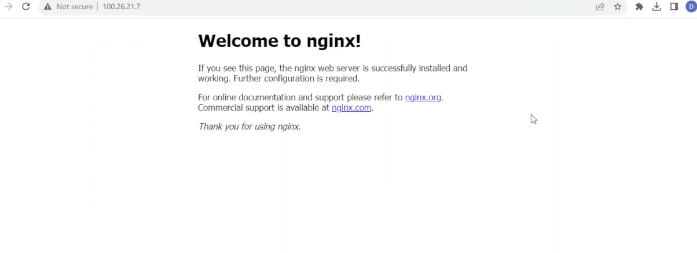

HOW TO LAUNCH AN EC2 INSTANCE AND INSTALL AN NGINX WEB SERVER VIA SSH
--------------------------------


Prerequisites

- AWS Account
- AWS CLI installed and configured with an Access key and Secret key for programmatic access to your AWS account.

If you don't know how to install and configure AWS CLI, please watch one of my videos here: https://www.youtube.com/watch?v=GW34S7mQZ2A&t=458s

1. Launch an EC2 Instance in AWS 
- Instance Name: my-instance


- AMI : Ubuntu 22.04
##  

##  
- Instance size: t2.micro

##  
- Create a keypair 
- keypair name: my-nginx-key  (RSA and pem selected)


##  
Security Group: 
Open ports 22 for SSH 
Open port 80 for web access 

We have checked SSH port 22
We need http port 80 but i'll leave it for now so you can see how to add it after our EC2 instance is running


##  

2. Access our EC2 instance in the AWS console to see if it is now running and ready


It is running but the status says it is still initialising

In the mean time, let us go to the security group and open http port 80.
We need to allow http access since we want to view the Nginx welcome page after it's installation from the web browser.

Without opening port 80, the connection will time out.
##  
Lets go to the security tab, click on the security group link and then edit inbound rules


##  
Select http and open to all 0.0.0.0/0


Save and return to our Instance page.
##  
Select our instance, go to the details tab and copy it's public IP address 100.26.21.7
Yours will be different from mine.


##  
Next we shall go to our terminal to log into our EC2 instance.

3. Go to our terminal and run the following command   
```
ssh -i "my-nginx-key.pem" ubuntu@100.26.21.7   
```


Use your own public IP as it will be different

Note: This command must be run in the directory where our private key is or you must give the path to the location of the private key
##  
4. Install Nginx

Let's first update our packages
```
sudo apt update
```
Now let's install Nginx

```
sudo apt install nginx
```
##  
After installation, we can go to our browser to view our Nginx installation
5. Go to your web browser and enter http://100.26.21.7

Replace with your own instances public IP

If everything was configured properly, you will see the Nginx Welcome Page
##  

You have successfully installed an Nginx webserver on an EC2 instance.